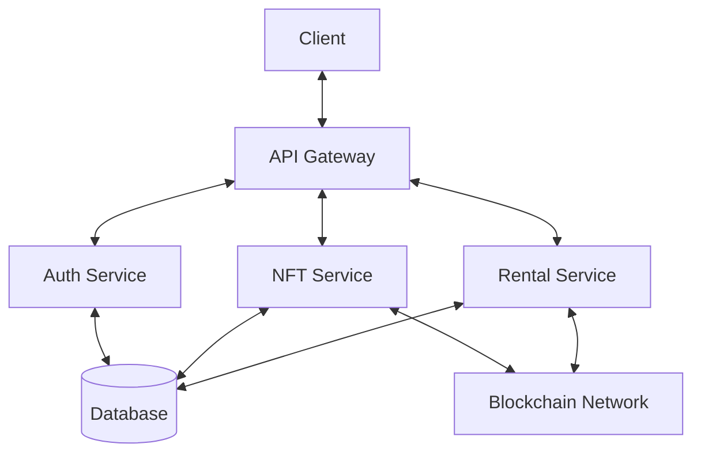

# System Architecture

This document provides an overview of Lendr's system architecture, components, and their interactions.

## High-Level Architecture

## Core Components

### 1. Frontend (Client)
- **Framework**: Next.js with React
- **State Management**: React Query + Zustand
- **Web3 Integration**: RainbowKit + Wagmi
- **UI Components**: Custom components with Tailwind CSS

### 2. Backend (API)
- **Framework**: NestJS
- **API Layer**: REST + WebSockets
- **Authentication**: JWT + SIWE (Sign-In With Ethereum)
- **Validation**: Class-validator + custom pipes

### 3. Database
- **Primary Database**: PostgreSQL
- **ORM**: Prisma
- **Migrations**: Prisma Migrate

### 4. Smart Contracts
- **Language**: Solidity
- **Framework**: Hardhat
- **Key Contracts**:
  - `RentalManager.sol`: Manages rental agreements
  - `ERC4907.sol`: NFT rental standard implementation
  - `ReputationSystem.sol`: Handles user ratings

## Data Flow

1. **User Authentication**
   - User connects wallet via MetaMask
   - Signs a message for verification
   - Receives JWT token for subsequent requests

2. **NFT Listing**
   - Owner approves NFT transfer to rental contract
   - Metadata is indexed and stored in the database
   - Listing becomes available in the marketplace

3. **Rental Process**
   - Renter selects NFT and rental duration
   - Collateral is locked in smart contract
   - NFT is transferred to renter's wallet
   - Automatic return after rental period

## Security Considerations

- **Smart Contract Security**:
  - Reentrancy protection
  - Access control modifiers
  - Pausable functionality
  - Comprehensive test coverage

- **API Security**:
  - Rate limiting
  - Input validation
  - CORS configuration
  - Helmet for HTTP headers

## Scalability

- **Database**:
  - Indexed queries
  - Connection pooling
  - Read replicas for high traffic

- **API**:
  - Stateless architecture
  - Horizontal scaling
  - Caching layer (Redis)

## Monitoring and Logging

- **Error Tracking**: Sentry
- **Logging**: Pino
- **Metrics**: Prometheus + Grafana
- **Alerting**: Configured for critical issues

## Deployment Architecture

- **Containerization**: Docker
- **Orchestration**: Kubernetes
- **CI/CD**: GitHub Actions
- **Monitoring**: Prometheus + Grafana
- **Logging**: ELK Stack

## Future Considerations

- Multi-chain support
- Layer 2 scaling solutions
- Decentralized storage (IPFS/Arweave)
- Cross-chain messaging (LayerZero/Wormhole)
